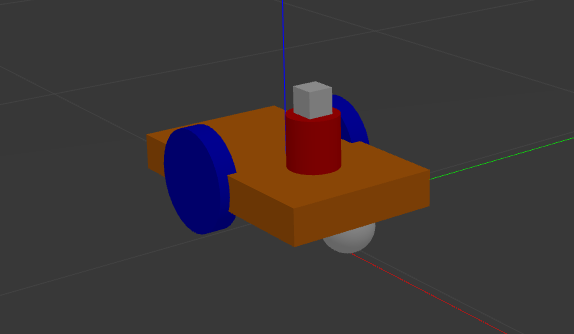
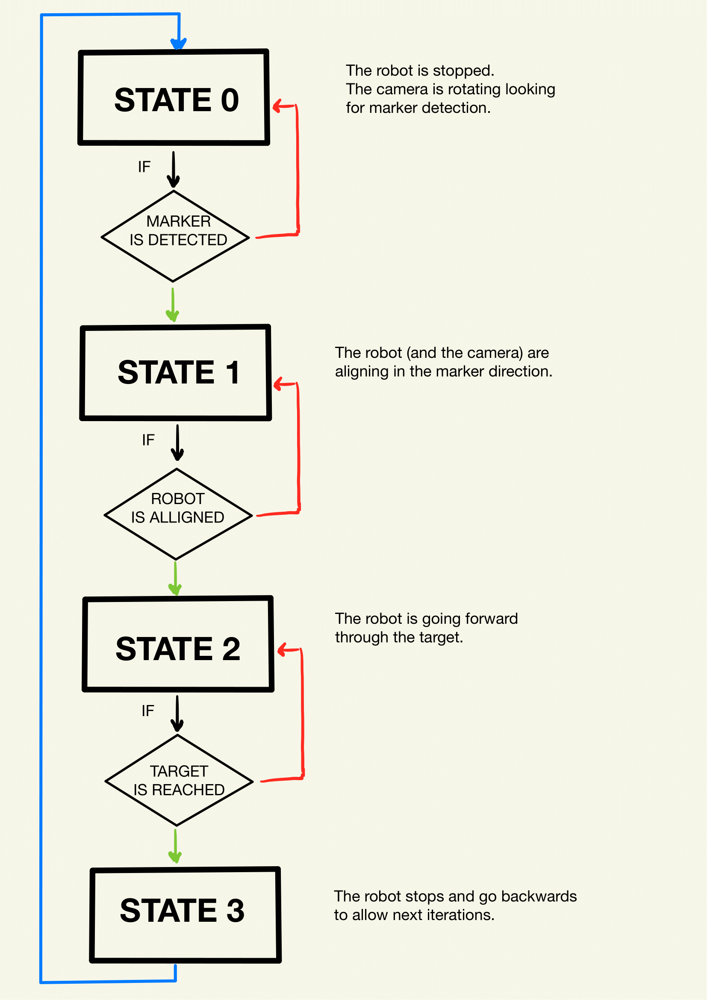
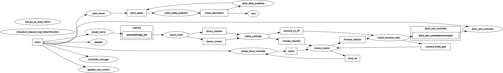

# Experimental Robotics Laboratory - Assignment 1

C. Demaria (s5433737) 🤓

G. Galvagni (s5521188) 🤓

E. Piacenti (s5636699) 🤓

## Description 📑

In this assignment, we are going to use **ROS2** in order to control a mobile robot in a 3D simulation environment called *Gazebo*.  
We have the robot starting in the position (0, 0), and four markers with IDs 11, 12, 13, and 15.  
The markers have the following meanings:  
Marker 11 -> rotate until you find marker 12; then reach marker 12  
Marker 12 -> rotate until you find marker 13; then reach marker 13  
Marker 13 -> rotate until you find marker 15; then reach marker 15  
Marker 15 -> done!  
The robot used in this simulation has been appropriately modified as illustrated.

## The Robot 🤖

We have created a versatile mobile platform equipped with essential components for navigation and perception. The main chassis, defined by the *link_chassis* element, forms the central structure of the robot, housing key components and providing stability. Attached to the chassis are two wheels, *link_right_wheel* and *link_left_wheel*, each connected through continuous joints (*joint_right_wheel* and *joint_left_wheel*), enabling smooth and continuous motion.  
 
A distinctive feature of this robot is its camera system, comprised of *link_camera_rot* and *camera_link*. The camera is mounted on a rotating joint (*joint_camera_rot*), allowing for dynamic orientation adjustments. This capability enhances the robot's perception and interaction with its environment.
 
<figure>

</figure>
 

## Logic of the program 🔄

The logic of the problem itself is really simple and it can be explained in only 4 states, as shown:

 
<figure>

</figure>
 

Going more in the details, the main nodes that manage the logic of the problem are three: *RobotController*, *MotorControl* and *RobotRevoluteNode*.  
*RobotController* enables the *RobotRevoluteNode* to start with the rotation of the camera: it looks for Aruco Marker and, in particular, it looks for the area of the Aruco Marker.  
While the area increases with the rotation of the camera, the node continues with the movement and it only stops when the area stops growing: this means that the robot should be almost aligned with the target.  
At this point the camera sends the actual value of the angle of rotation so the robot can aligned too: during this process, the *MotorController* publishes to the *RobotRevoluteNode* its rotation speed, so the camera can rotate in the opposite direction and remain aligned with the camera.  
Once both robot and camera are aligned, the robot starts going straight.  
While the robot goes, the *RobotController* checks the length of the longest side visible from the camera: when it surpasses a threshold, it means that the target is reached and the process can restart with the next marker.  
Once all the markers are reached, all the nodes shut down.

## The Nodes ⛓

The ROS 2 graph, showing the nodes and the connections between them:
 
<figure>

</figure>
 

## ROBOT CONTROLLER 🧠

The ROS2 node RobotControl for controlling a robot's motion based on the detection of ArUco markers through a camera. The node follows a marker-based navigation approach, utilizing marker information to guide the robot's movements.

### Subscribers

1. **Aruco Markers Subscriber (aruco_markers):**
   - Listens for information about ArUco markers detected by the camera.
   - Updates the internal state with marker IDs.
2. **Aruco Corners Subscriber (aruco_corners):**
   - Listens for updates on the corners of detected ArUco markers.
   - Updates the internal state with the corners' coordinates.
     
### Publishers

1. **Camera On/Off Publisher (camera_on_off):**
   - Publishes a `Bool` message to activate or deactivate camera rotation for searching ArUco markers.
2. **Marker Reached Publisher (marker_reached):**
   - Publishes a `Bool` message indicating whether the robot has reached the targeted ArUco marker or if the target has been lost from the camera's view.

### Timer

- Utilizes a timer to execute the main controller logic periodically.

### Internal Variables

- `id_marker:` ID of the current ArUco marker to reach.
- `position_marker:` Position of the current marker in the list of markers seen by the camera.
- `corners_marker:` Corners of the currently targeted ArUco marker.
- `goal_markers:` List of ArUco markers to reach.
- `reached_marker:` Number of markers successfully reached.
- `flag:` Flag used for the main logic to switch between camera rotation and marker following.
- `flag_marker:` Flag to check if the targeted marker is found by the camera.
- `last_marker_area:` Value for comparing two consecutive measurements of the room areaalue for comparing two consecutive measurements of the room area.
- `iteration:` Wait the inaccurate measurement of the camera.

### Controller Logic

1. Camera Rotation Mode (flag == 0):
   - Activates camera rotation and waits for a targeted ArUco marker to be found.
   - When a marker is found, transitions to marker following mode.
2. Marker Following Mode (flag == 1):
   - Follows the targeted ArUco marker using camera feedback.
   - Checks if the marker is within a specified area to consider it reached.
   - Publishes messages to indicate marker reaching status.
3. Completion Condition:
   - Terminates the node when all specified ArUco markers are successfully reached.

## MOTOR CONTROL 🚂

The ROS2 node MotorControl for controlling the robot's motion through the input that it received from the RobotControl node. The node simply wait for receiving the angle of the Aruco Marker detection and it alligns with it, so it go straight until it received from the controller a stop message.

### Subscribers

1. **Odometry Subscriber (odom):**
   - Listens and updates the orientation of the robot.
   - Used for allign the robot with the detection angle of the Aruco Marker.
2. **Camera Angle Subscriber (camera_theta_goal):**
   - Receives the angle of the detected Aruco Marker.
   - When the node received it, it begins to allign itself to this orientation.
3. **Marker Reached Subscriber (marker_reached):**
   - Receives a Bool from the controller.
   - It means that the area of the Aruco Marker is sufficiently big, so the robot can stop.
     
### Publishers

1. **Command Velocity Publisher (cmd_vel):**
   - Publishes a `Twist` message to move the robot inside the environment.
2. **Inverse Rotation Publisher (inverse_rotation):**
   - Used for sincronyze the rotation of the robot with the opposite rotation of the camera, in order to let the camera know the verse in which it has to rotate.

### Internal Variables

- `theta:` The actual orientation angle of the robot.
- `theta_goal:` The orientation angle received from the detection of the Aruco Marker.
- `flag:` Used to actually manage the states of the node.
- `dt:` Used for the timer and the sleep function inside the node.

### Timer and Controller Logic

- Utilizes a timer to execute the main controller logic periodically using a flag:
   - **flag = 0:** The robot is waiting for receiving the angle of detection: when it receives from the `camera_theta_goal` topic, it passes through the next state;
   - **flag = 1:** The robot is alligning with the Aruco Marker and it constantly publish to the camera its actual rotation speed in order to let the camera rotates in the opposite direction;
   - **flag = 2:** The robot is going straight to the Aruco Marker until it receives a 'stop message' from the controller;
   - **flag = 3:** The robot stops and go backwards to allow next iteration.

## ROBOT REVOLUTE NODE 📹

### Description
This ROS2 node controls the camera joint attached to a vertical link that rotates along the z-axis.

### Subscribers
1. **Camera Modality Subscriber**
   - **Topic:** `camera_on_off`
   - **Message Type:** `Bool`
   - **Callback Function:** `camera_modality_callback`
   
   This node listens to the robot_action_client to know if:
   	**True** = the joint has to rotate constantly looking for a new tarket
   	**False** it has to compensate the rotation of the four wheeled robot

2. **Rotation Subscriber**
   - **Topic:** `inverse_rotation`
   - **Message Type:** `Float64`
   - **Callback Function:** `rotation_callback`
   
   This node listens to the motor_controller to know in which direction the four wheel robot is rotating. Knowing the values, it just simply compensate 
   in the opposite direction the camera.

3. **Marker Reached Subscriber**
   - **Topic:** `marker_reached`
   - **Message Type:** `Bool`
   - **Callback Function:** `marker_reached_callback`
   
   This node listen to the robot_action_client to know if a marker is reached.

### Publishers
1. **Rotation Goal Publisher**
   - **Topic:** `camera_theta_goal`
   - **Message Type:** `Float64`
   - **Published by:** `publisher_rotation_goal`
   
   This node send the current angle of rotation to the four wheeled robot to know the orientation that is required to the robot to reach the next marker

2. **Joint Commands Publisher**
   - **Topic:** `/joint_cam_controller/commands`
   - **Message Type:** `Float64MultiArray`
   - **Published by:** `cmd_vel_pub`
   
   This node updates the joint position along the z-axis of a certain angle during a fixed time

### Internal Variables
- **`dt`:** Control loop cycle time (seconds)
- **`sign`:** Direction of rotation (-1 or 1) that represents counter-clockwise and clockwise rotation
- **`current_angle`:** Current angle of the camera (Float64)
- **`modality`:** Camera modality (Bool) - True for searching new markers, False for compensating the wheeled robot rotation
- **`angular_velocity`:** Current angular velocity of the wheeled robot (Float64)
- **`theta_goal`:** Current angle of the camera to the rotation controller (Float64). It is sent to the four wheeled robot to know where the markers is.
- **`modality_timer`:** Timer for checking camera modality
- **`cnt_shutdown`:** Counter for marker reached events, after reaching the last one, the node shutsdown.

### Timer and Controller Logic
- **Timer:** `modality_timer` triggers the `camera_modality` function every `dt` seconds.
- **Controller Logic:**
  - If `modality` is True, the camera rotates incrementally, and commands are published to rotate the joint.
  - If `modality` is False, the node compensates for robot rotation based on the angular velocity, adjusting the camera angle and publishing the goal angle.

## Install and run ⚙

First of all, you need to download the repository with the following command inside your workspace:

    git clone https://github.com/claudioDema99/ExpLab-FirstAssignment

From the root directory of your ROS2 workspace run the command:

    colcon build

Now, you have to install `konsole` with the command:

    sudo apt-get install konsole

Inside the `/src/ExpLab-FirstAssignment` of your root directory and use:

    chmod u+x launch_exp.sh
    
Finally, to run the code, type the following command:

    bash launch_exp.sh

## Videos 📼

The video showcasing the robot's motion in the Gazebo environment as it navigates and interacts with its surroundings. The video provides a visual representation of how the robot responds to the environment, demonstrating its movements and behaviors:

https://github.com/claudioDema99/ExpLab-FirstAssignment/assets/114250896/425a8420-1c74-4e93-bcef-bf3c2a1b7a72

The robot's camera through an Rviz video, offering a glimpse into its perspective and visual observations. Gain insight into what the camera captures and how it operates:

https://github.com/claudioDema99/ExpLab-FirstAssignment/assets/114250896/50d890b1-f94b-49b8-abd3-637680c6a316

## Possible improvements 📈

We attempted to implement an action-client server for motion control, integrating relative positions obtained from the camera with respect to the robot's frame and absolute positions from odometry. During initial tests using known relative positions, the robot exhibited precise movements—moving perpendicularly to each marker and stopping accurately.

However, when we incorporated coordinates obtained from the camera, the robot's motion became erratic. After conducting numerous tests, we identified a potential issue with the relative positions due to the lack of camera calibration.

To enhance the system, we are considering camera calibration to rectify the inaccuracies associated with the relative positions. This calibration process aims to improve the accuracy of the camera data, which should subsequently result in more reliable and precise robot movements. Probabily, after calibration we will assess the impact on the overall performance of the action-client server for motion control.

